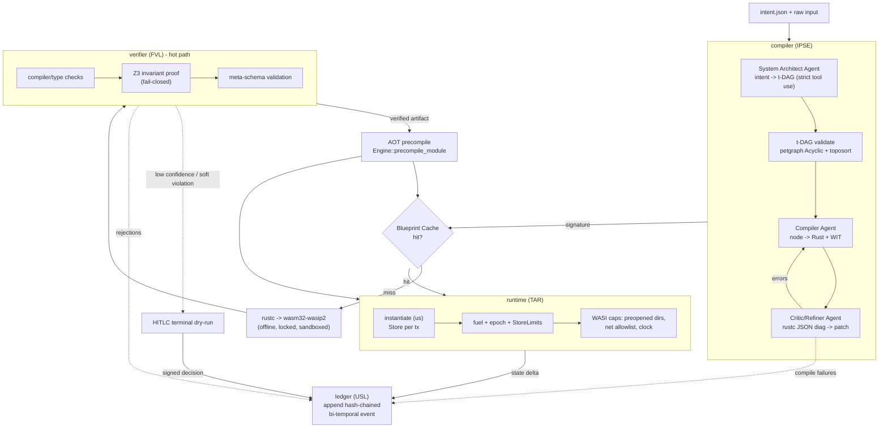
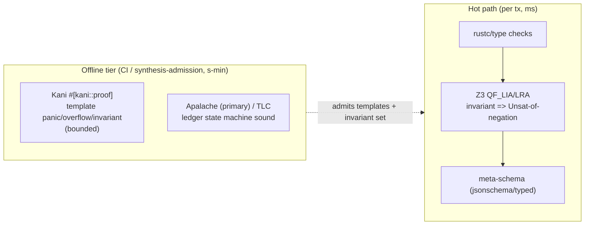

# feat: AETHER Engine — V1 "Ephemeral Data Pipe"

> **Target repo:** `aether-engine` (this working directory, `C:\AETHER` — not yet a git repo; init as part of U1).
> **Scope decision (confirmed with user):** full-fidelity LLM→Rust→`rustc`→WASM JIT synthesis, the complete Formal Verification Layer (Z3 + bounded model checking + TLA+ state-machine bridge), and **V1 "Ephemeral Data Pipe" breadth** (batch ingestion, schema transforms, external API sync, blueprint cache, scheduler daemon) — not the smallest MVP. V2–V4 (ephemeral microservices, self-optimization, bare-metal kernel) remain a documented evolution path, not implementation units.

---

## Summary

AETHER synthesizes software that exists only for the duration of a transaction. This plan builds the V1 engine: a single-tenant Rust system that takes a declarative **intent** plus a raw data stream, decomposes it into a verified **temporal DAG (t-DAG)** of execution steps, JIT-compiles each step from LLM-generated Rust into a gas-metered WASM sandbox, verifies safety invariants before execution, runs the pipeline, and appends the verified state change to an immutable bi-temporal semantic ledger — then tears the sandbox down.

The work splits into six tightly-coupled subsystems (SDK, USL ledger, TAR runtime, FVL verifier, IPSE compiler, CLI/daemon) plus an offline verification tier. The first end-to-end deliverable is the **EDID** path — `aether run --intent ./intent.json --input ./raw.csv --ledger ./state.db` — proving the full thesis with no static human-written code in the runtime path. V1 breadth then extends that core with API connectors, the blueprint cache hit-path, and a watch daemon.

The hardest engineering risk is not code generation but **orchestrating untrusted, AI-generated code through compilation and verification safely and fast enough to be useful.** Two decisions carry that risk: the **Blueprint Cache** (amortizes the unavoidable 2–8s cold `rustc` compile to sub-ms cached instantiation) and the **two-tier FVL** (a fast per-transaction gate of compiler + Z3 + schema validation, backed by an offline Kani/Apalache tier that verifies the machinery and the invariant set themselves).

---

## Problem Frame

Static application layers are a liability: they ossify around the 99% case, accrue technical debt, and require human DevOps to maintain. The asset is the *business intent* and the *historical state ledger*, not the code. AETHER treats synthesized code as a disposable intermediate state.

**Who it serves (V1):** systems/operations engineers who today hand-write brittle ETL (Airflow/Fivetran/cron) and the integration glue around it. They declare domains, invariants, and compliance boundaries; AETHER synthesizes and runs the pipelines.

**What V1 must prove:** that arbitrary tabular/structured input can be ingested, transformed by JIT-synthesized + formally-gated WASM, and written to an immutable ledger — repeatably, safely, and (on cache hit) fast — with the safety invariants enforced by *static, human-audited* Rust, never by the LLM.

**Non-goals for V1:** the self-synthesizing web UI (DUIG beyond a terminal/JSON fallback), multi-tenancy, a distributed runtime, V3 self-optimization, and the V4 kernel. Human-in-the-loop (HITLC) is terminal/JSON only in V1.

---

## Requirements

Traceability IDs are referenced by implementation units below.

- **R1 — Intent ingestion.** Parse and validate an `intent.json` (objective string + hardcoded-invariant references + I/O descriptors) at the system boundary; reject malformed intent with a clear error.
- **R2 — t-DAG synthesis.** Decompose an intent into a JSON-defined temporal DAG of typed step nodes via the System Architect agent; the graph must be proven acyclic and topologically orderable before any compilation.
- **R3 — Node code synthesis.** For each t-DAG node, generate strongly-typed Rust targeting `wasm32-wasip2`, with WIT-defined I/O boundaries between nodes.
- **R4 — Compile-critic loop.** Drive a bounded generate→compile→diagnose→patch loop against `rustc` until zero errors or an iteration cap; feed structured (`--error-format=json`) diagnostics back; abort and escalate on stagnation.
- **R5 — Hot-path verification gate.** Before execution, verify each compiled artifact and each proposed ledger mutation against **hardcoded** safety invariants using compiler/type checks + Z3 (e.g. `usd_amount >= 0.0`, `balance >= 0`, `partner_id ∈ known_partners`). Fail closed on `Unknown`/timeout.
- **R6 — Meta-schema validation.** Validate every proposed ledger mutation against a static meta-schema before append; reject non-conforming mutations.
- **R7 — Sandboxed execution.** Execute each WASM module in an isolated Wasmtime sandbox with zero ambient authority: capabilities (specific preopened dirs, network allowlist, clock) injected per the verified t-DAG node only.
- **R8 — Gas metering & runaway termination.** Enforce a deterministic per-node instruction budget (fuel); terminate runaways via an epoch + wall-clock backstop.
- **R9 — Immutable bi-temporal ledger.** Append verified state changes as hash-chained, tamper-evident events to an embedded semantic store supporting "state as of any point in time" (transaction-time + valid-time) querying. Never mutate or delete.
- **R10 — Correction log.** Persist every compilation failure, verification rejection, and human intervention as first-class events in the same ledger stream (the proprietary "correction & compilation ledger").
- **R11 — Blueprint Cache.** When an incoming intent matches a verified t-DAG structural signature, bypass synthesis + compilation and instantiate the pre-compiled, AOT-cached WASM artifact directly.
- **R12 — CLI/daemon surface.** Provide `aether run` (one-shot) and `aether watch` (daemon over a monitored input source); all V1 interaction is file-system/CLI/JSON — no GUI.
- **R13 — V1 breadth.** Support batch ingestion, schema transforms, and external API sync (outbound, domain-pinned) as intent-expressible pipeline node types.
- **R14 — Offline verification tier.** Provide a CI/admission-time tier that (a) proves synthesized-code *templates* are panic/overflow-free and invariant-preserving for bounded inputs (Kani), and (b) proves the ledger *state machine* is sound (Apalache/TLC). Not on the request path.
- **R15 — HITLC (terminal fallback).** When confidence is below threshold or a non-fatal constraint is touched, serialize a deterministic dry-run, present it via terminal/JSON, capture a signed operator decision, and write it to the ledger.

---

## Key Technical Decisions

**KTD1 — Cargo workspace of crates, one orchestrating binary.** Six library crates (`sdk`, `ledger`, `runtime`, `verifier`, `compiler`) plus a `cli` binary crate, in one workspace. Rationale: high cohesion / low coupling per subsystem, independent test surfaces, and the `sdk` crate as the shared vocabulary (intent types, t-DAG types, capability descriptors, error envelope) every other crate depends on. Alternatives (single crate; one repo per subsystem) rejected — single crate loses module boundaries the architecture is built on; multi-repo is premature for single-tenant V1.

**KTD2 — Blueprint Cache is load-bearing, not an optimization.** The runtime path is content-addressed in three layers: (1) `intent/t-DAG signature → .wasm` (skip `rustc`), (2) `.wasm hash + engine version → AOT native artifact` via `Engine::precompile_module` → `Module::deserialize_file` (skip Cranelift), (3) warm `Engine` + pooling allocator (µs instantiation). Cold synthesis (2–8s `rustc` + tens-to-hundreds ms Cranelift) is unavoidable on first sight of a novel intent; the blueprint's <2s/<500µs targets are **only** achievable on cache hit, and the plan states this explicitly rather than implying cold synthesis is fast. The AOT artifact is `unsafe` to load and version-specific — cache keys include the Wasmtime/Cranelift version, and AETHER signs/hashes artifacts it produces (never loads untrusted artifacts).

**KTD3 — Invariants are hardcoded static Rust; the LLM only proposes mutations.** The FVL's invariant set is version-controlled, compiler-checked Rust — never generated or proposed by the LLM. This confines hallucination to "proposing a mutation that gets rejected," the safe failure mode. The trust boundary: compiler/type system rejects malformed mutations structurally → Z3 proves no hardcoded invariant can be violated (fail-closed) → meta-schema validation gates the append.

**KTD4 — Two-tier FVL.** Hot path (per transaction, ms-scale): rustc/type checks + Z3 (`z3` 0.20.1, vendored static build, money modeled as integer cents or `Real` — never IEEE floats) + flat meta-schema validation. Offline tier (CI/synthesis-admission, seconds-to-minutes): **Kani** harnesses prove the synthesized-code *templates* are panic/overflow-free and invariant-preserving for bounded inputs; **Apalache** (primary) / **TLC** prove the ledger state machine. WASM-bytecode symbolic execution is deferred (research-grade, no production Rust tooling) — runtime containment comes from the Wasmtime sandbox (fuel/epoch/memory/capability limits), not runtime symbolic proof.

**KTD5 — Ledger behind a swappable `Ledger` trait; CozoDB default.** `ledger` crate exposes a repository-pattern trait (`append_event`, `query_as_of`, `verify_chain`, …). Default impl: **CozoDB 0.7.6** (`storage-sqlite` backend) for native bitemporal time-travel via its `Validity` type (transaction-time) plus explicit `valid_from`/`valid_to` columns (valid-time). Hedge: Cozo is essentially single-maintainer — the trait lets us swap to an **Oxigraph 0.5.9** (RDF/SPARQL) or hand-rolled `rusqlite` triple-table impl without touching IPSE/TAR. Integrity via per-event `blake3` hash chain.

**KTD6 — Claude over raw HTTP; structured output via strict tool use.** Rust has no official Anthropic SDK, so the `compiler` crate calls `/v1/messages` over `reqwest` (a thin internal client; community crates evaluated but pinned-HTTP gives us control over retries/streaming/headers). t-DAG and synthesized code are returned via **strict tool use** (`strict: true`, `additionalProperties: false`) or `output_config.format` JSON schema so outputs validate structurally. Model tiering: `claude-opus-4-8` (adaptive thinking, effort `high`/`xhigh`) for the System Architect (SAA) and Critic/Refiner (CRA) agents; `claude-haiku-4-5` viable for cheap mechanical Compiler-agent (CA) passes. Stream for large `max_tokens`. Handle `stop_reason == "refusal"` before reading content.

**KTD7 — Reflexion-shaped compile-critic loop.** Actor (CA generates) → Evaluator (deterministic: `rustc`/`clippy` exit + JSON diagnostics, parsed by `cargo_metadata`) → Self-Reflection (CRA turns diagnostics into a lesson, prepended to the next attempt and logged to the correction ledger). Convergence guards: hard iteration cap (3–5), feed *structured* diagnostics not prose, diff-based localized patching, stagnation detection (candidate/diagnostic-set hashing; abort + escalate to HITLC if error count stops shrinking).

**KTD8 — Compilation is the real attack surface; lock the build environment.** `build.rs` scripts and proc-macros run arbitrary native code at compile time, outside any WASM sandbox. The synthesis compile step runs offline (`cargo build --offline --locked`) with vendored, allowlisted dependencies, in an OS-level sandbox (container/seccomp/Landlock) with no secrets in env, read-only FS except scratch, no network, and CPU/mem/time ulimits. Single-file guest nodes compile via `rustc` directly to bypass cargo's build-script machinery where feasible. `cargo-deny` + `cargo-audit` gate the dependency set.

**KTD9 — t-DAG enforced acyclic at construction.** Use `petgraph` 0.8's `Acyclic` wrapper so a cycle-creating edge is rejected at insertion, plus `toposort` for the deterministic execution order (tie-broken by node insertion index for replay determinism).

---

## High-Level Technical Design

### Subsystem dataflow (runtime path)



### Two-tier verification



Both diagrams render authoritative content for review; the prose is the source of truth on any conflict.

---

## Output Structure

```text
aether-engine/
├── Cargo.toml                 # workspace
├── crates/
│   ├── sdk/                   # shared vocabulary: Intent, TDag, Capability, Mutation, error envelope, Ledger trait
│   ├── ledger/                # USL: CozoDB impl behind Ledger trait, bi-temporal model, hash chain, correction log
│   ├── runtime/               # TAR: wasmtime host, fuel/epoch/limits, WASI cap injection, Blueprint Cache
│   ├── verifier/              # FVL hot path: type checks, Z3 invariant engine, meta-schema validation
│   └── compiler/              # IPSE: Claude HTTP client, SAA/CA/CRA agents, t-DAG, rustc driver, compile-critic loop
├── cli/                       # `aether` binary: run / watch, orchestration wiring
├── verification/              # offline tier: Kani harnesses (Rust), TLA+ specs (.tla) for Apalache/TLC
├── examples/                  # sample intents + raw data (utility-bills, schema-transform, api-sync)
├── guests/                    # WIT worlds + the locked, vendored guest build environment
└── tests/                     # integration suite + compiler-invariant assertions
```

Scope-declaring tree; per-unit `**Files:**` are authoritative for what each unit creates.

---

## Implementation Units

### Phase 0 — Foundations

#### U1. Workspace scaffold & SDK vocabulary
- **Goal:** Establish the Cargo workspace, git repo, CI skeleton, and the `sdk` crate that defines every type crossing subsystem boundaries.
- **Requirements:** R1 (intent types), R2 (t-DAG types), R7 (capability descriptors), R9 (mutation/event types). Foundation for all.
- **Dependencies:** none.
- **Files:** `Cargo.toml`, `.gitignore`, `rust-toolchain.toml`, `crates/sdk/Cargo.toml`, `crates/sdk/src/lib.rs`, `crates/sdk/src/intent.rs`, `crates/sdk/src/tdag.rs`, `crates/sdk/src/capability.rs`, `crates/sdk/src/mutation.rs`, `crates/sdk/src/error.rs`, `crates/sdk/src/ledger_trait.rs`, `deny.toml`.
- **Approach:** `serde`-derived types for `Intent`, `TDag`/`TDagNode`/`EdgeKind`, `Capability` (preopened dirs, net allowlist, clock policy, fuel budget), `Mutation` and `LedgerEvent` (with `prev_hash`/`curr_hash` fields), and a unified `AetherError` envelope. Define the `Ledger` trait here (KTD5) so `ledger` is swappable. Money type: a `Cents(i64)` or fixed-point newtype — **not** `f64` — locked now (KTD4).
- **Patterns to follow:** repository-pattern trait for `Ledger`; consistent API-response envelope (success/data/error) from `common/patterns.md`.
- **Test scenarios:**
  - Round-trip serialize/deserialize a representative `Intent` (objective + invariant refs + I/O descriptors). `Covers AE1` (intent.json from blueprint).
  - Reject `Intent` missing required fields with a typed `AetherError`, not a panic.
  - `Capability` defaults to zero authority (empty preopened dirs, empty net allowlist) when unspecified.
  - `Cents` arithmetic saturates/errors on overflow; no `f64` field exists on money-bearing types (compile-time + a guard test).
  - `LedgerEvent` exposes `prev_hash`/`curr_hash` and a stable canonical serialization for hashing.
- **Verification:** `cargo build` + `cargo test -p sdk` green; `cargo deny check` passes; workspace members resolve.

#### U2. Claude HTTP client (`reqwest`) with strict-tool-use structured output
- **Goal:** A thin internal Anthropic Messages client the IPSE agents call, returning schema-validated structured output.
- **Requirements:** R2, R3, R4 (the transport all three agents use).
- **Dependencies:** U1.
- **Files:** `crates/compiler/Cargo.toml`, `crates/compiler/src/llm/mod.rs`, `crates/compiler/src/llm/client.rs`, `crates/compiler/src/llm/messages.rs`, `crates/compiler/src/llm/tool_schema.rs`.
- **Approach:** `reqwest` async client → `POST /v1/messages`. Support: `claude-opus-4-8` and `claude-haiku-4-5` model selection; `thinking: {type:"adaptive"}` + `output_config.effort`; **strict tool use** (`strict: true`, `additionalProperties:false`, `required`) and/or `output_config.format` JSON schema for typed returns; streaming for large `max_tokens`; retry/backoff (429/5xx). Read `ANTHROPIC_API_KEY` from env (KTD6, never hardcode). **Check `stop_reason == "refusal"` before reading content.** Keep prompt prefixes stable for cache hits (frozen system prompt, deterministic tool order).
- **Patterns to follow:** raw-HTTP shape from the cURL examples in the claude-api reference; tool-use JSON parsing via `serde_json` (never raw string-match).
- **Test scenarios:**
  - Builds a valid request body for a strict-tool-use call (schema with `additionalProperties:false`, `required`); golden-JSON assertion.
  - Parses a `tool_use` response into a typed Rust struct; rejects a response that violates the schema.
  - Surfaces `stop_reason == "refusal"` as a typed recoverable error, not an index panic on empty `content`.
  - Retries on a simulated 429 with backoff; gives up after cap. (Mock transport.)
  - Secret is read from env; absent key produces a clear startup error (no hardcoded fallback).
- **Verification:** `cargo test -p compiler --test llm_client` green against a mocked transport; a gated live smoke test (`#[ignore]`) hits the real API once and asserts `response.model` starts with `claude-opus-4-8`.

---

### Phase 1 — Unified Semantic Ledger (USL)

#### U3. Ledger core: CozoDB impl, bi-temporal model, hash chain
- **Goal:** Implement the `Ledger` trait over CozoDB with append-only events, bi-temporal querying, and tamper-evident hash chaining.
- **Requirements:** R9, R10.
- **Dependencies:** U1.
- **Files:** `crates/ledger/Cargo.toml`, `crates/ledger/src/lib.rs`, `crates/ledger/src/cozo_store.rs`, `crates/ledger/src/schema.rs`, `crates/ledger/src/temporal.rs`, `crates/ledger/src/hashchain.rs`.
- **Approach:** `cozo` 0.7.6 with `storage-sqlite`. Triples/quads stored with Cozo `Validity` (transaction-time) **plus** explicit `valid_from`/`valid_to` columns (valid-time) — the two axes are distinct and must not collapse (KTD5). Each event row carries `prev_hash` + `curr_hash = blake3(canonical(payload) || prev_hash)`. `query_as_of(tx_time, valid_time)` reconstructs logical state. Append-only discipline: no UPDATE/DELETE; retraction is a `Retract` event. The correction log (`CompileFailure`, `VerificationRejection`, `HumanIntervention`) are first-class events in the **same** stream (R10) so they participate in the hash chain.
- **Patterns to follow:** repository pattern (`Ledger` trait from U1); event-sourcing immutability.
- **Test scenarios:**
  - Append three triples; `query_as_of` at an intermediate tx-time returns only the first; at latest returns all. `Covers AE2`.
  - Valid-time vs transaction-time are independently queryable (assert a fact recorded at T2 but valid-from T0 surfaces correctly for both axes).
  - `verify_chain()` returns Ok on an untampered log; mutate one historical payload out-of-band and assert every downstream `curr_hash` mismatches.
  - A `Retract` event hides a prior assertion without deleting the row.
  - Correction-log events (`CompileFailure`) round-trip in the same stream and are chained.
  - Concurrent appends serialize deterministically (single-writer); no lost events.
- **Verification:** `cargo test -p ledger` green; a temp-file Cozo DB is created, populated, and chain-verified in an integration test.

---

### Phase 2 — Transient Assembly Runtime (TAR)

#### U4. Wasmtime host, gas metering, resource & runaway limits
- **Goal:** Instantiate and execute a `.wasm` module in an isolated `Store` with a deterministic fuel budget and an epoch + wall-clock kill-switch.
- **Requirements:** R7 (isolation), R8 (gas + runaway termination).
- **Dependencies:** U1.
- **Files:** `crates/runtime/Cargo.toml`, `crates/runtime/src/lib.rs`, `crates/runtime/src/host.rs`, `crates/runtime/src/limits.rs`, `crates/runtime/src/exec.rs`.
- **Approach:** `wasmtime` 46.x. `Engine` (process-shared) → `Store<T>` per transaction. Fuel via `Config::consume_fuel(true)` + `store.set_fuel(budget)`; trap on `Trap::OutOfFuel`. Epoch interruption (`epoch_interruption(true)` + background ticker + `set_epoch_deadline`) **and** a `tokio::time::timeout` wrapping the async call as belt-and-suspenders (Cranelift only — epochs are incompatible with Winch). `StoreLimits` caps linear memory / instances. Async execution model.
- **Patterns to follow:** one `Store` = one ephemeral execution unit; explicit error handling on `OutOfMemory`/`OutOfFuel`.
- **Test scenarios:**
  - A bounded counting module runs to completion within budget and returns its result.
  - An infinite-loop module is terminated by fuel exhaustion (`OutOfFuel` trap) deterministically at the same instruction across runs.
  - A module that spins on 0-fuel constructs is killed by the epoch/timeout backstop.
  - A module attempting to grow memory past `StoreLimits` is rejected.
  - Fuel determinism: same module + same budget traps identically twice.
- **Verification:** `cargo test -p runtime --test sandbox` green using small pre-built `.wat`/`.wasm` fixtures (no rustc dependency in this unit's tests).

#### U5. WASI capability injection (zero ambient authority)
- **Goal:** Grant a guest module *only* the capabilities its verified t-DAG node declares — specific preopened dirs, an outbound-network allowlist, clock policy — nothing else.
- **Requirements:** R7 (least privilege), R13 (domain-pinned API sync).
- **Dependencies:** U4, U1 (`Capability`).
- **Files:** `crates/runtime/src/wasi_caps.rs`, `crates/runtime/src/net_guard.rs`.
- **Approach:** `wasmtime-wasi` (p2 / component model). `WasiCtxBuilder` starts with zero authority; map a `Capability` descriptor → `.preopened_dir(...)`, env/args/stdio opt-in, and network: deny by default, allow per `.socket_addr_check(...)` callback enforcing an IP/port allowlist. For true domain (hostname) allowlisting, front outbound calls through `wasmtime-wasi-http` and match on request host. Clock withheld or injected as a fixed host function when determinism is required.
- **Patterns to follow:** capability-based security (deny-by-default); input validation at the boundary.
- **Test scenarios:**
  - A guest granted only `/scratch` can read it but cannot open a path outside it (capability error, not a filtered string compare).
  - A guest with an empty net allowlist is denied all outbound connections.
  - A guest with `api.example.com` allowlisted connects there and is denied `evil.example.com`.
  - Env/secrets are invisible to a guest unless explicitly granted.
  - `Covers F-api-sync / AE-api-sync` — an api-sync node reaches only its pinned domain.
- **Verification:** `cargo test -p runtime --test capabilities` green with fixture guests exercising allowed/denied paths and sockets.

#### U6. Blueprint Cache (AOT precompile + content-addressed store)
- **Goal:** Make re-execution sub-millisecond by caching compiled artifacts keyed on intent/t-DAG signature and `.wasm` hash + engine version.
- **Requirements:** R11, R8 (instantiation perf).
- **Dependencies:** U4.
- **Files:** `crates/runtime/src/blueprint_cache.rs`, `crates/runtime/src/aot.rs`.
- **Approach:** Three layers (KTD2): (1) `signature → .wasm` path map (skip rustc), (2) `.wasm hash + wasmtime/cranelift version → AOT artifact` via `Engine::precompile_module` → persisted → `Module::deserialize_file` (skip Cranelift; `unsafe`, version-keyed, integrity-hashed by AETHER), (3) warm `Engine` + pooling allocator for µs instantiation. Cache is content-addressed on disk; signature derived from the canonicalized t-DAG structure (not transient data values).
- **Patterns to follow:** content-addressed/immutable cache; never deserialize untrusted artifacts.
- **Test scenarios:**
  - Cold path: novel signature misses; after compile+precompile, the artifact is stored under the right key.
  - Warm path: same signature hits and instantiates without recompiling (assert no Cranelift compile occurred — timing/counter or a compile-hook spy).
  - Engine-version bump invalidates AOT artifacts (different key); stale artifact is not loaded.
  - Tampered/foreign artifact fails the integrity check and is refused (not deserialized).
  - Two different intents with the same structural t-DAG signature share a blueprint.
- **Verification:** `cargo test -p runtime --test blueprint_cache` green; a microbenchmark (`#[ignore]`, criterion-style) demonstrates warm instantiation much faster than cold compile.

---

### Phase 3 — Formal Verification Layer (FVL), hot-path tier

#### U7. Z3 invariant engine (hardcoded, fail-closed)
- **Goal:** Prove a proposed mutation cannot violate any hardcoded safety invariant, using Z3.
- **Requirements:** R5, KTD3 (invariants are static), KTD4.
- **Dependencies:** U1 (`Mutation`, `Cents`).
- **Files:** `crates/verifier/Cargo.toml`, `crates/verifier/src/lib.rs`, `crates/verifier/src/invariants.rs`, `crates/verifier/src/z3_engine.rs`.
- **Approach:** `z3` 0.20.1 with the `vendored` feature (pinned static Z3, reproducible semantics). Invariants are hardcoded Rust functions (`balance >= 0`, `usd_amount >= 0.0` over `Cents`/`Real`, `partner_id ∈ known_partners`) — **never** LLM-authored. To prove an invariant holds for a mutation: encode pre-state + delta, assert the **negation** of the post-invariant, expect `Unsat`. Keep constraints in the decidable fragment (QF_LIA/QF_LRA); set a solver timeout; treat `Unknown`/timeout as **reject** (fail-closed). One `Context` per worker (not `Send`).
- **Patterns to follow:** fail-closed security default; explicit error handling.
- **Test scenarios:**
  - A transfer that would drive `balance` negative is rejected (counterexample found = invariant violable).
  - A valid transfer that preserves `balance >= 0` is admitted (`Unsat` of negation).
  - `usd_amount >= 0.0` modeled over integer cents / `Real`, never `f64`; a negative amount is rejected.
  - `partner_id` not in the known set is rejected; one in the set is admitted.
  - A constraint that returns `Unknown`/times out is **rejected** (fail-closed), with the rejection logged.
  - Concurrent verifier workers each use an isolated `Context` (no cross-thread AST sharing).
- **Verification:** `cargo test -p verifier --test invariants` green; vendored Z3 builds in CI.

#### U8. Meta-schema validation gate
- **Goal:** Validate every proposed mutation against a static meta-schema before append.
- **Requirements:** R6.
- **Dependencies:** U1, U7.
- **Files:** `crates/verifier/src/meta_schema.rs`, `crates/verifier/schemas/mutation.schema.json`.
- **Approach:** Per research (KTD4), the V1 meta-schema is **flat, closed-world record validation** — typed Rust structs + `serde` + the `jsonschema` crate, **not** SHACL/RDF (deferred until constraints become genuinely ontological — see Scope Boundaries). Runs in-process, sub-ms. Composes after type checks and Z3 in the hot-path gate.
- **Patterns to follow:** validate at system boundary; fail fast with clear errors.
- **Test scenarios:**
  - A conforming mutation passes; a mutation with an unknown field / wrong type is rejected against the schema.
  - A mutation missing a required attribute is rejected with a field-level message.
  - The combined hot-path gate (type → Z3 → schema) rejects on the first failing stage and logs which stage.
- **Verification:** `cargo test -p verifier --test meta_schema` green.

---

### Phase 4 — Intent Parse & Synthesis Engine (IPSE)

#### U9. Intent parsing & t-DAG model
- **Goal:** Parse/validate `intent.json` and define the t-DAG data structure with construction-time acyclicity.
- **Requirements:** R1, R2.
- **Dependencies:** U1, U2.
- **Files:** `crates/compiler/src/intent_parse.rs`, `crates/compiler/src/tdag/mod.rs`, `crates/compiler/src/tdag/graph.rs`, `crates/compiler/src/tdag/validate.rs`.
- **Approach:** Validate intent at the boundary (objective present, invariant refs resolve to *known hardcoded* invariants, I/O descriptors well-formed). t-DAG built through `petgraph` 0.8 `Acyclic` wrapper (cycle-creating edges rejected at insertion) + `toposort` for deterministic order, tie-broken by insertion index (KTD9).
- **Patterns to follow:** input validation; immutable graph once validated.
- **Test scenarios:**
  - Valid `intent.json` parses; invariant refs resolve. `Covers AE1`.
  - Intent referencing an unknown invariant is rejected (the LLM cannot introduce invariants — KTD3).
  - Adding a cycle-creating edge to the t-DAG is rejected at construction.
  - `toposort` yields a stable order across runs for the same graph.
  - A diamond-shaped DAG orders dependencies before dependents.
- **Verification:** `cargo test -p compiler --test tdag` green.

#### U10. System Architect Agent (SAA): intent → t-DAG
- **Goal:** Decompose an intent into a JSON-defined t-DAG via Claude, with current ledger state + global ontology as context.
- **Requirements:** R2.
- **Dependencies:** U2, U9, U3 (ledger state input).
- **Files:** `crates/compiler/src/agents/saa.rs`, `crates/compiler/src/agents/prompts/saa_system.txt`.
- **Approach:** `claude-opus-4-8`, adaptive thinking, effort `high`; strict-tool-use schema for the t-DAG node/edge structure so the return validates into the U9 types. Context: objective, resolved invariant set (read-only), and a summary of relevant ledger state. The agent proposes structure only — it never authors invariants (KTD3).
- **Execution note:** Start with a failing test asserting a known intent yields a valid, acyclic t-DAG with the expected node count/shape against a recorded fixture response; then implement.
- **Patterns to follow:** structured output via strict tool use (U2); stable prompt prefix for caching.
- **Test scenarios:**
  - Recorded-fixture intent ("import utility bills, convert EUR→USD, flag variance>20%, save") yields a t-DAG with ingest → transform → flag → persist nodes; validates via U9. `Covers F-edid / AE1`.
  - A returned graph containing a cycle is caught by U9 validation and triggers a re-request or error (not silently accepted).
  - The agent's tool output that omits a required field is rejected by the strict schema.
- **Verification:** `cargo test -p compiler --test saa` green against recorded fixtures; live `#[ignore]` smoke test produces a valid t-DAG.

#### U11. Compiler Agent (CA) + Critic/Refiner (CRA): the compile-critic loop
- **Goal:** For each node, synthesize Rust + WIT, compile against `rustc`, and drive a bounded Reflexion-shaped repair loop to zero errors.
- **Requirements:** R3, R4, R10 (failures logged).
- **Dependencies:** U2, U9, U12 (rustc driver), U3 (correction log).
- **Files:** `crates/compiler/src/agents/ca.rs`, `crates/compiler/src/agents/cra.rs`, `crates/compiler/src/loop/repair.rs`, `crates/compiler/src/loop/diagnostics.rs`, `crates/compiler/src/agents/prompts/ca_system.txt`, `crates/compiler/src/agents/prompts/cra_system.txt`.
- **Approach:** CA (`claude-haiku-4-5` or `opus`) generates node Rust + WIT I/O types from the node spec. Compile via U12; parse `rustc --error-format=json` with `cargo_metadata`. On failure, CRA (`opus`, effort `high`) turns *structured* diagnostics into a minimal localized patch + a natural-language lesson, prepended to the next attempt and written to the correction ledger (R10). Convergence guards (KTD7): hard iteration cap (3–5), diff-based patching, stagnation detection (hash diagnostic set; abort + escalate to HITLC if not shrinking).
- **Execution note:** Test-first on the loop controller using a *stub* compiler that returns scripted diagnostics, so convergence/stagnation logic is tested without invoking real `rustc` or the LLM.
- **Patterns to follow:** Reflexion (Actor/Evaluator/Self-Reflection); feed structured errors not prose; immutable correction-log events.
- **Test scenarios:**
  - Loop converges: stubbed compiler returns 2 errors then 0; controller stops, returns the artifact.
  - Loop respects the iteration cap: stub always returns errors → aborts at N, escalates, logs failures.
  - Stagnation: stub returns the same diagnostic set twice → aborts early (before cap) and escalates.
  - Each compile failure is written as a `CompileFailure` correction-log event (R10).
  - Diagnostics are passed to CRA as parsed JSON spans/codes, not prose.
- **Verification:** `cargo test -p compiler --test repair_loop` green against the stubbed compiler; a gated integration test compiles one real generated node end-to-end.

#### U12. rustc → WASM driver (locked, sandboxed build)
- **Goal:** Compile generated Rust to `wasm32-wasip2` in a locked-down environment, returning the `.wasm` or structured diagnostics.
- **Requirements:** R3, R4, KTD8 (build security).
- **Dependencies:** U1.
- **Files:** `crates/compiler/src/rustc_driver.rs`, `guests/wit/`, `guests/vendor/`, `guests/Cargo.lock`, `crates/compiler/src/build_sandbox.rs`.
- **Approach:** Single-file guest nodes compiled via `rustc` directly (bypassing cargo build-scripts where feasible); multi-dep nodes via `cargo build --offline --locked` against **vendored, allowlisted** deps. The compile runs in an OS-level sandbox (container/seccomp/Landlock per platform) with no network, no secrets in env, read-only FS except scratch, and CPU/mem/time ulimits (KTD8). `cargo-deny`/`cargo-audit` gate the dependency set. Returns `Ok(wasm_bytes)` or parsed diagnostics for the U11 loop. **Note:** the Rust project's sandboxed-build-script effort is not stable as of 2026 — AETHER provides this isolation itself.
- **Execution note:** This unit hard-depends on a Rust toolchain + `wasm32-wasip2` target + an OS sandbox primitive being available in the runtime environment — flagged as an Open Question / prerequisite.
- **Patterns to follow:** no-network build; least-privilege compiler process; never trust LLM-introduced dependencies.
- **Test scenarios:**
  - A valid generated module compiles to a non-empty `.wasm` targeting `wasm32-wasip2`.
  - A module with a type error returns structured JSON diagnostics (spans, error codes), not a raw string blob.
  - A module attempting network access in a `build.rs` is blocked by the sandbox (no egress).
  - An LLM-introduced dependency outside the allowlist is rejected by `cargo-deny` before compile.
  - Compile respects the wall-clock ulimit and is killed if exceeded.
- **Verification:** `cargo test -p compiler --test rustc_driver` green where a toolchain is present (skip-with-warning otherwise); sandbox egress-denial verified.

---

### Phase 5 — Orchestration: the EDID path

#### U13. `aether run` — end-to-end one-shot orchestration
- **Goal:** Wire intent → SAA → (cache check) → CA/CRA → rustc → FVL → AOT → TAR → USL into the `aether run` command, proving the full thesis.
- **Requirements:** R1–R12 integrated; R15 (HITLC entry point).
- **Dependencies:** U3, U4, U5, U6, U7, U8, U9, U10, U11, U12.
- **Files:** `cli/Cargo.toml`, `cli/src/main.rs`, `cli/src/run.rs`, `cli/src/orchestrator.rs`, `cli/src/hitlc.rs`.
- **Approach:** `aether run --intent ./intent.json --input ./raw.csv --ledger ./state.db`. Orchestrator executes the topologically-ordered t-DAG: for each node, Blueprint-Cache check → on miss synthesize+compile+verify+AOT+cache → instantiate in TAR with the node's capabilities → run → collect output → next node. Final verified mutations pass the FVL gate (U7/U8) and append to the USL (U3). Low-confidence/soft-violation nodes route to the terminal HITLC dry-run (R15): serialize state to JSON, prompt operator, capture a signed decision, write to ledger. No GUI (R12).
- **Patterns to follow:** container/orchestration separation; consistent error envelope; immutable ledger append last.
- **Test scenarios:**
  - End-to-end on the utility-bills example: EUR→USD conversion correct, variance>20% lines flagged, `state.db` populated, exit 0. `Covers F-edid / AE1`.
  - A node violating an invariant aborts the pipeline cleanly, logs a `VerificationRejection`, and leaves the ledger unchanged for that transaction (atomicity).
  - Re-running the same intent hits the Blueprint Cache (no recompile) and produces identical ledger state given identical input.
  - A low-confidence node triggers the terminal HITLC dry-run; a signed "approve" continues, a "reject" aborts and logs.
  - Malformed input data surfaces a clear boundary error, not a panic.
- **Verification:** `cargo test --test e2e_edid` green (toolchain-gated); manual `aether run` on `examples/utility-bills/` produces the expected `state.db`.

---

### Phase 6 — Offline verification tier

#### U14. Kani template harnesses + Apalache/TLC ledger model
- **Goal:** Provide the offline tier that admits synthesized-code templates and proves the ledger state machine — run in CI / at synthesis-admission, never on the request path (KTD4, R14).
- **Requirements:** R14.
- **Dependencies:** U3 (ledger semantics), U11/U12 (template shapes), U7 (invariant set).
- **Files:** `verification/kani/Cargo.toml`, `verification/kani/src/templates.rs`, `verification/tla/ledger.tla`, `verification/tla/ledger.cfg`, `verification/README.md`, `.github/workflows/verify.yml`.
- **Approach:** **Kani** `#[kani::proof]` harnesses over the allowed synthesized-code *templates* (the bounded shapes CA may emit): prove no panic, no arithmetic overflow, and invariant-preservation for `kani::any()` inputs under a declared `--default-unwind`. Pin a modern SAT backend (CaDiCaL/Kissat — >200× over MiniSat in published benchmarks). **Apalache** (primary; symbolic, handles large data domains — good for financial models) with **TLC** as the explicit-state fallback, modeling the ledger state machine (no double-spend, monotonic where required, valid partner-state transitions). Both invoked as CI subprocesses parsing JSON output. Honest framing: these gate *templates and the invariant set*, not live mutations (which Z3 handles at runtime).
- **Execution note:** Characterization-first — encode the *current* invariant set and one known-good template, prove green, before expanding coverage. Bound Kani unwind and Apalache depth explicitly; document the bounds.
- **Patterns to follow:** offline gate distinct from runtime gate; fail-closed in CI.
- **Test scenarios (verification harnesses, not unit tests):**
  - Kani proves a representative transform template never panics/overflows for bounded inputs; an intentionally-buggy template fails the harness (counterexample produced).
  - Kani proves a mutation-applying template preserves `balance >= 0` for all bounded inputs.
  - Apalache proves the ledger spec admits no state reaching a negative balance within depth `k`; an intentionally-broken `Next` relation yields a counterexample trace.
  - CI job runs both tiers headless and fails the build on any counterexample.
  - `Test expectation: none` for raw runtime perf — this tier is correctness-only, off the hot path.
- **Verification:** `cargo kani` (in `verification/kani`) and `apalache-mc check verification/tla/ledger.tla` both pass in CI; the broken-fixture variants fail as expected.

---

### Phase 7 — V1 "Ephemeral Data Pipe" breadth

#### U15. Pipeline node library: ingestion, schema transform, API sync
- **Goal:** Support the V1 intent-expressible node types beyond the EDID example — batch CSV/structured ingestion, schema transforms, and domain-pinned outbound API sync.
- **Requirements:** R13, R7 (caps for API sync), R5/R6 (verified like any node).
- **Dependencies:** U10–U13, U5 (net allowlist).
- **Files:** `crates/compiler/src/nodes/ingest.rs`, `crates/compiler/src/nodes/transform.rs`, `crates/compiler/src/nodes/api_sync.rs`, `examples/schema-transform/`, `examples/api-sync/`.
- **Approach:** Extend the SAA's node vocabulary and the CA's synthesis templates to cover: batch ingestion (CSV/JSON/structured), schema transforms (column rename/derive/type-coerce), and outbound API sync routed through the U5 net allowlist (domains from the intent's contract). Each new node type flows through the same synthesis→verify→sandbox→ledger path — no special-casing the trust boundary.
- **Patterns to follow:** same FVL gate for every node type; capabilities scoped per node.
- **Test scenarios:**
  - A schema-transform intent (rename + derive a column) produces correct output and a populated ledger. `Covers F-schema-transform / AE-schema`.
  - An api-sync node POSTs only to its contract-pinned domain; an attempt to reach an unlisted domain is denied at the sandbox.
  - A batch-ingest node handles an empty input file and a malformed row without panicking (row-level error reported).
  - An api-sync node's outbound failure (timeout/4xx) is surfaced and logged, not silently swallowed.
- **Verification:** `cargo test --test pipeline_nodes` green; the two new example intents run end-to-end.

#### U16. `aether watch` daemon
- **Goal:** Monitor an input source and run the matching intent pipeline on new data, leaning on the Blueprint Cache for fast repeat execution.
- **Requirements:** R12 (daemon), R11 (cache hit-path is the steady state).
- **Dependencies:** U13, U6.
- **Files:** `cli/src/watch.rs`, `cli/src/daemon.rs`.
- **Approach:** `aether watch --intent ./intent.json --source ./incoming/ --ledger ./state.db`. File-system watcher (`notify` crate) triggers the U13 orchestration per new file; steady-state runs hit the Blueprint Cache (synthesis/compile bypassed). Graceful shutdown drains in-flight transactions. Single-tenant, single-host (no distribution — V1 scope).
- **Patterns to follow:** drain-on-shutdown; cache-hit is the common path.
- **Test scenarios:**
  - Dropping a new file into the watched dir triggers exactly one pipeline run and one ledger append.
  - The second+ runs of the same intent hit the Blueprint Cache (no recompile).
  - Shutdown signal drains an in-flight transaction before exit (no partial/torn ledger append).
  - A file that fails verification is logged and skipped without crashing the daemon.
- **Verification:** `cargo test --test watch_daemon` green; manual run processes a sequence of dropped files into a consistent ledger.

---

## Scope Boundaries

### Deferred to follow-up work (this product, later)
- **SHACL/RDF ontological meta-schema.** V1 uses flat closed-world validation (`jsonschema` + typed structs, U8). Adopt `oxirs-shacl`/`rudof` only if ledger constraints become genuinely graph-shaped (cross-entity shapes, inferred classes). Don't pay the RDF tax speculatively.
- **WASM-bytecode symbolic execution.** Research-grade (SeeWasm-class, no production Rust library). Runtime containment is the Wasmtime sandbox; symbolic reasoning value comes from Kani at the Rust/MIR level (U14).
- **Deductive functional-correctness verifiers** (Creusot/Prusti) for unbounded proofs — Kani's bounded model checking suffices for V1.
- **Oxigraph/SPARQL ledger backend** — implemented behind the `Ledger` trait only if RDF-standard interop becomes a requirement (the trait makes it a drop-in).

### Outside this product's identity (per blueprint evolution path)
- **V2 — Ephemeral Microservices** (JIT stateful API endpoints from webhooks).
- **V3 — Autonomic Optimization Loop** (self-optimizing native-binary caching from telemetry).
- **V4 — Ephemeral Operating Kernel** (bare-metal hypervisor / synthesized drivers).
- **Multi-tenancy, distributed runtime, billing, and the self-synthesizing web UI (DUIG)** beyond the V1 terminal/JSON HITLC fallback.

---

## Risks & Dependencies

| Risk | Severity | Mitigation |
|---|---|---|
| **Hallucinated invariants** — LLM emits code that evades safety. | Critical | Invariants are hardcoded static Rust (KTD3); LLM only proposes mutations; FVL adjudicates via compiler + Z3 (fail-closed) + schema. LLM never authors a proof obligation. |
| **Compile-time RCE** — `build.rs`/proc-macros in AI-generated code run arbitrary native code on the build host. | Critical | Locked offline sandboxed build (KTD8): no network, vendored allowlisted deps, OS sandbox, `cargo-deny`/`cargo-audit`, single-file `rustc` where feasible. |
| **Synthesis latency** — cold `rustc`→WASM is 2–8s; blueprint targets unmet for novel intents. | High | Blueprint Cache (KTD2) amortizes to µs on hit; the plan states cold synthesis is inherently slow and only cached execution is fast. |
| **Runaway / infinite-loop modules.** | High | Fuel (deterministic budget) + epoch + `tokio` timeout backstop + `StoreLimits` (U4). |
| **Non-converging repair loop** burns tokens / never finishes. | Medium | Hard iteration cap, structured-diagnostic feedback, stagnation detection, HITLC escalation (KTD7, U11). |
| **Verifier-trust subtlety** — Z3/CBMC are themselves large programs. | Medium | Pin/vendor exact solver versions; fail-closed on `Unknown`/timeout; treat the *invariant definitions* as the audited security-critical artifact; offline Apalache proves the invariant set is mutually consistent. |
| **CozoDB single-maintainer / true-bitemporal is partly manual.** | Medium | `Ledger` trait (KTD5) keeps the store swappable; valid-time carried in explicit columns, not over-promised as "free bitemporal." |
| **Build environment prerequisites** — Rust toolchain + `wasm32-wasip2` + OS sandbox primitive must exist at runtime. | Medium | Documented prerequisite (Open Questions); U12 skips-with-warning when absent. |

**External dependencies:** Anthropic API key (`ANTHROPIC_API_KEY`); a Rust toolchain with the `wasm32-wasip2` target and `cargo-component`; a vendored Z3 build (cmake); Kani + Apalache (+JVM) for CI; an OS-level sandbox primitive (container/seccomp/Landlock).

---

## Open Questions

- **Build sandbox primitive (platform).** The dev/working environment is Windows (`win32`). Landlock/seccomp are Linux-only; the locked compile sandbox (KTD8/U12) needs a concrete answer per target OS — container (Docker/Podman), a Linux build host/CI, or a Windows job-object + restricted-token approach. *Blocking for U12 on Windows; non-blocking if synthesis compiles run in a Linux container/CI.* — resolve before U12.
- **HITLC confidence threshold.** What numeric confidence (or which soft-constraint classes) trigger the terminal dry-run vs. auto-proceed? Deferred to implementation tuning against the EDID example; default conservative (escalate on any soft-constraint touch).
- **Cargo-component vs direct `rustc` per node.** Component-model guests (`cargo-component`, WIT) give clean typed boundaries but pull in cargo's build machinery (harder to lock down) and are slower; single-file `rustc` is faster/safer but limits inter-node WIT typing. U10/U12 should benchmark both on a real node early and pick per node-complexity.
- **Blueprint signature granularity.** What exactly is hashed into a t-DAG "structural signature" (node types + edges + WIT contracts, excluding transient data) — affects cache hit-rate vs. correctness. Resolve during U6 with the EDID + schema-transform examples.

---

## Sources & Research

External research was load-bearing on the runtime, verification, ledger, and LLM-interface decisions (greenfield — no local patterns existed). Key sources:

- **Wasmtime** embedding/fuel/epoch/AOT — docs.rs `wasmtime` 46.x; Wasmtime Book "Interrupting Wasm Execution"; `WASI-capabilities.md`; Component Model Rust language support. (KTD2, U4–U6)
- **Build security** — Rust Project Goals "Sandboxed build scripts" (not stable 2026); Rust/Cargo supply-chain security writeups. (KTD8, U12)
- **Z3 from Rust** — `prove-rs/z3.rs`, `z3` crate 0.20.1 (static bindings, vendored build). (KTD4, U7)
- **Kani** — model-checking.github.io/kani (CBMC backend, `#[kani::proof]`, bounded, SAT-backend perf); "Verifying the Rust std lib" (arXiv 2510.01072). (KTD4, U14)
- **TLA+** — Apalache (symbolic, financial-tx framing, JSON-RPC API) vs TLC (explicit-state). (KTD4, U14)
- **Ledger** — CozoDB 0.7.6 time-travel/`Validity` docs; Oxigraph 0.5.9; `petgraph` 0.8 `acyclic` + `toposort`; `blake3`. (KTD5, KTD9, U3, U9)
- **Agentic repair loop** — Reflexion (arXiv 2303.11366); "Is Self-Repair a Silver Bullet?" (ICLR 2024 / arXiv 2306.09896); SafeTrans (arXiv 2505.10708); CRUST-Bench (arXiv 2504.15254); `cargo_metadata` for diagnostic parsing. (KTD7, U11)
- **Claude API** — Rust has no official SDK → raw HTTP via `reqwest`; strict tool use / `output_config.format` for structured output; `claude-opus-4-8` ($5/$25 per MTok, 1M ctx) for SAA/CRA, `claude-haiku-4-5` ($1/$5) for CA; adaptive thinking + effort; handle `refusal`. (KTD6, U2, U10, U11)
